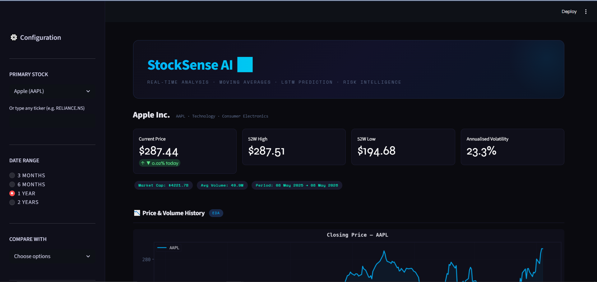
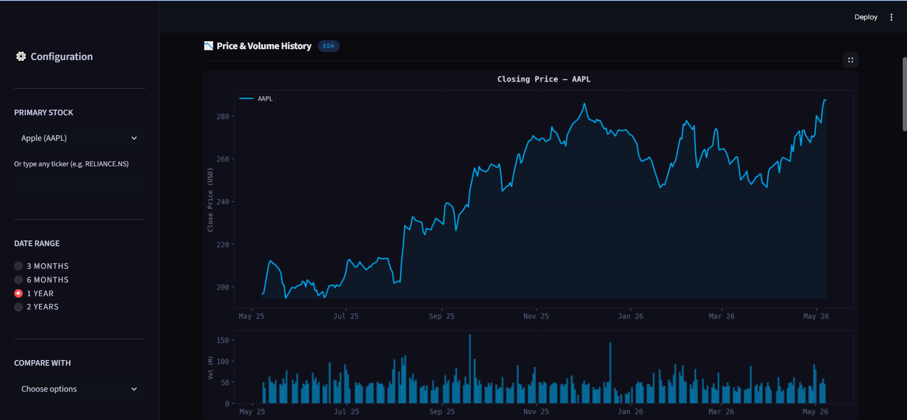
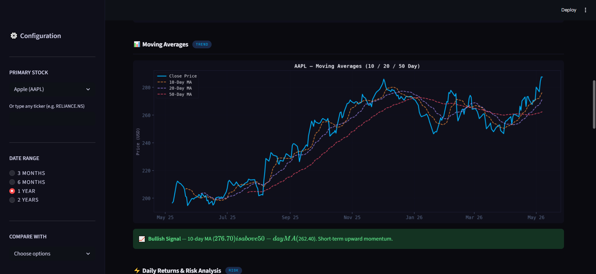
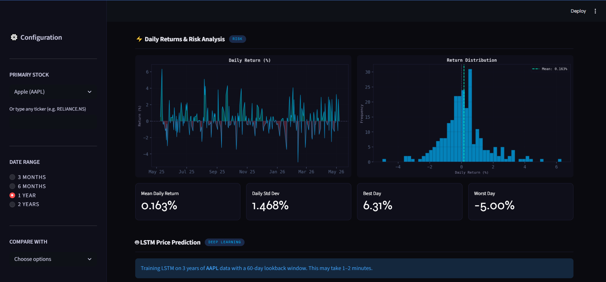
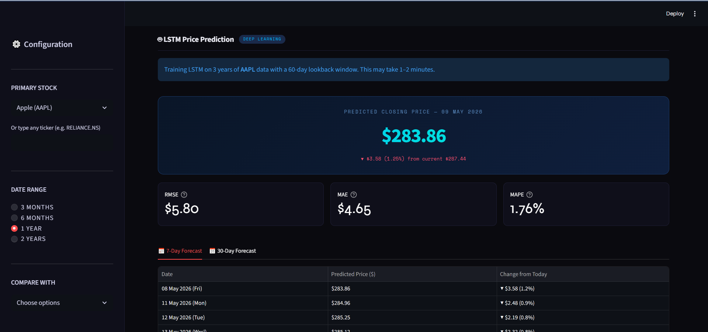
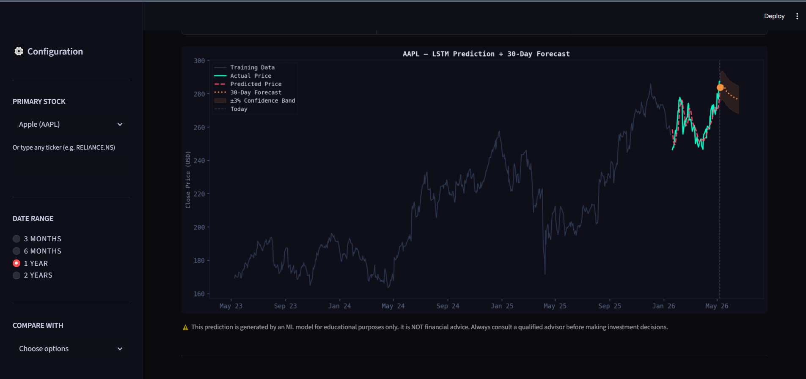

# 📈 StockSense AI — Stock Market Analysis & Prediction

A professional Streamlit web app for real-time stock analysis and LSTM-based price prediction.

**Built by:** Amrit Jha | B.Tech 3rd Year (CSE - AI & ML)



---

## 🚀 Features

- 📊 **Live Stock Data** — fetches real-time OHLCV data via yfinance (no CSV needed)
- 📉 **Price & Volume Charts** — interactive dark-themed visualisations
- 📈 **Moving Averages** — 10 / 20 / 50 day MA with buy/sell signal detection
- ⚡ **Daily Return & Risk Analysis** — distribution, volatility, best/worst day
- 🔗 **Multi-Stock Comparison** — correlation heatmap + risk vs return scatter
- 🤖 **LSTM Price Prediction** — deep learning model predicts next day's closing price
- 📅 **7-Day & 30-Day Forecast** — rolling future price prediction with confidence band
- 🎯 **Model Metrics** — RMSE, MAE, MAPE displayed clearly

---

## 📸 Screenshots

### 🏠 Dashboard & Key Metrics


### 📉 Price & Volume History


### 📈 Moving Averages (10 / 20 / 50 Day)


### ⚡ Daily Returns & Risk Analysis


### 🤖 LSTM Price Prediction + Forecast Table


### 📆 30-Day Forecast Chart


---

## 🛠️ Tech Stack

| Category | Tools |
|---|---|
| Frontend | Streamlit |
| Deep Learning | Keras, TensorFlow |
| Data Source | yfinance (Yahoo Finance API) |
| Data Processing | Pandas, NumPy |
| Visualisation | Matplotlib, Seaborn |
| ML Utilities | Scikit-learn |

---

## ▶️ How to Run Locally

### 1. Clone the repo
```bash
git clone https://github.com/Amritjh/StockSense-AI.git
cd StockSense-AI
```

### 2. Install dependencies
```bash
pip install -r requirements.txt
```

### 3. Run the app
```bash
streamlit run app.py
```

### 4. Open browser
The app opens automatically at `http://localhost:8501`

---

## ☁️ Deploy Free on Streamlit Cloud

1. Push this repo to GitHub
2. Go to [share.streamlit.io](https://share.streamlit.io)
3. Connect your GitHub repo
4. Set main file as `app.py`
5. Click **Deploy** — live in 2 minutes!

---

## 📁 Project Structure

StockSense-AI/
├── app.py                  ← Main Streamlit application
├── requirements.txt        ← Python dependencies
├── README.md               ← This file
└── screenshots/            ← App screenshots for README
├── dashboard.png
├── price_volume.png
├── moving_averages.png
├── risk_analysis.png
├── prediction.png
└── forecast_chart.png


⭐ If you found this useful, give it a star on GitHub!